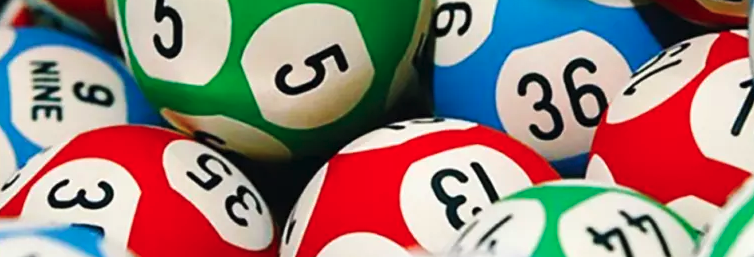

# ML-SixMark-Lab

  

## Project Overview

This project was developed with the assistance of Gemini and completed in approximately one hour.

This repository explores the application of Machine Learning (ML) techniques to the Hong Kong Mark Six lottery.  It's crucial to understand that **lottery outcomes are inherently random, and no model can reliably predict winning numbers.** This project is purely for educational and experimental purposes, demonstrating how ML models, specifically Long Short-Term Memory (LSTM) networks, can be applied to sequential data like lottery results.  **Do not use this code for gambling or making financial decisions.**

## Disclaimer

The Hong Kong Mark Six lottery is a game of chance.  The results generated by this model are purely random and should not be interpreted as predictions of future outcomes.  **Gambling can be addictive and financially harmful.  Please gamble responsibly.**

## Results

The initial run of the LSTM model yielded the following results:

* Tickets Purchased: 341
* Total Spending: $3410
* Total Reward: $3880
* Net Earn: $470
* Earn Ratio: 13.78% 

**Important:** These results are from a single run and are likely due to random chance.  Repeated runs will produce different results, and the average outcome is expected to be a loss (as with any lottery).  **Do not use these results as an indication of the model's predictive power.**